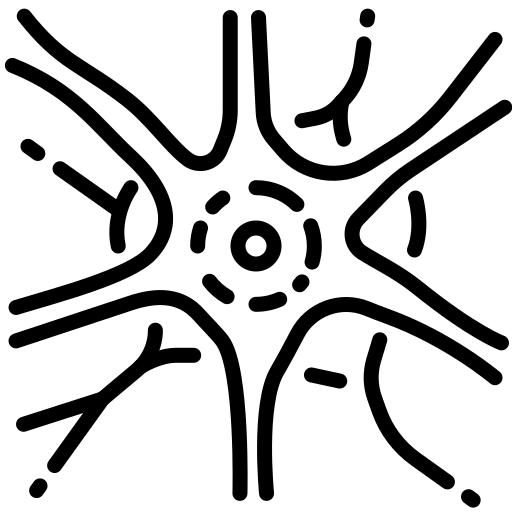

<h1 align="center">
Madam optimiser
</h1>

<p align="center">
  
</p>

<p align="center">
  <a href="https://jeremybernste.in" target="_blank">Jeremy&nbsp;Bernstein</a> &emsp; <b>&middot;</b> &emsp;
  <a href="https://jiawei-zhao.netlify.app" target="_blank">Jiawei&nbsp;Zhao</a> &emsp; <b>&middot;</b> &emsp;
  <a href="https://www.bbe.caltech.edu/people/markus-meister" target="_blank">Markus&nbsp;Meister</a> <br>
  <a href="http://mingyuliu.net/" target="_blank">Ming&#8209;Yu&nbsp;Liu</a> &emsp; <b>&middot;</b> &emsp;
  <a href="http://tensorlab.cms.caltech.edu/users/anima/" target="_blank">Anima&nbsp;Anandkumar</a> &emsp; <b>&middot;</b> &emsp;
  <a href="http://www.yisongyue.com" target="_blank">Yisong&nbsp;Yue</a>
</p>

## Getting started

- Jax: [open the demo notebook in Colab](https://colab.research.google.com/github/jxbz/madam/blob/master/jax/fourfeat_demo.ipynb).
- Pytorch: grab [madam.py](https://github.com/jxbz/madam/blob/master/pytorch/optim/madam.py) and place it in your project directory. Then type:
```python
from madam import Madam
optimizer = Madam(net.parameters(), lr=0.01, p_scale=3.0, g_bound=10.0)
```
To understand what the different parameters do, note that the typical Madam update to a parameter is:

```math
w --> w exp(± lr).
```

The largest possible Madam update to a parameter is:
```math
w --> w exp(± g_bound x lr).
```

And finally the parameters are clipped to lie within the range `± init_scale x p_scale`.

An initial learning rate of `lr = 0.01` is the recommended default. The algorithm converges to a solution which "jitters" around the true solution, at which point the learning rate should be decayed. We didn't experiment much with g_bound, but `g_bound = 10` was a good default. p_scale controls the size of the optimisation domain, and it was worth tuning this in the set `[1.0, 2.0, 3.0]`.

## About this repository

This repository was built by <a href="https://jeremybernste.in" target="_blank">Jeremy&nbsp;Bernstein</a> and <a href="https://jiawei-zhao.netlify.app" target="_blank">Jiawei&nbsp;Zhao</a> to accompany the following paper:

> [Learning compositional functions via multiplicative weight updates](https://arxiv.org/abs/2006.14560).

We're putting this code here so that you can test out our optimisation algorithm in your own applications, and also so that you can attempt to reproduce the experiments in our paper.

If something isn't clear or isn't working, let us know in the *Issues section* or contact [bernstein@caltech.edu](mailto:bernstein@caltech.edu).

## Repository structure

    .
    ├── pytorch/                # Pytorch code to reproduce experiments in the paper.
    ├── jax/                    # A Jax demo notebook.
    ├── LICENSE                 # The license on our algorithm.
    └── README.md               # The very page you're reading now.
    
## Acknowledgements

- Our GAN implementation is based on a codebase by [Jiahui Yu](http://jiahuiyu.com/).
- Our Transformer and ImageNet code are forked from the [Pytorch examples](https://github.com/pytorch/examples/) repository.
- Our CIFAR-10 classification code is orginally by [kuangliu](https://github.com/kuangliu/pytorch-cifar).
- Our Jax demo is based on the [Fourier feature networks](https://people.eecs.berkeley.edu/~bmild/fourfeat/) codebase.

## Citation

If you find Madam useful, feel free to cite [the paper](https://arxiv.org/abs/2006.14560):

```bibtex
@misc{madam2020,
    title={Learning compositional functions via multiplicative weight updates},
    author={Jeremy Bernstein and Jiawei Zhao and Markus Meister and Ming-Yu Liu and Anima Anandkumar and Yisong Yue},
    year={2020},
    eprint={arXiv:2002.03432}
}
```

## License

We are making our algorithm available under a [CC BY-NC-SA 4.0](https://creativecommons.org/licenses/by-nc-sa/4.0/) license. The other code we have used obeys other license restrictions as indicated in the subfolders.
